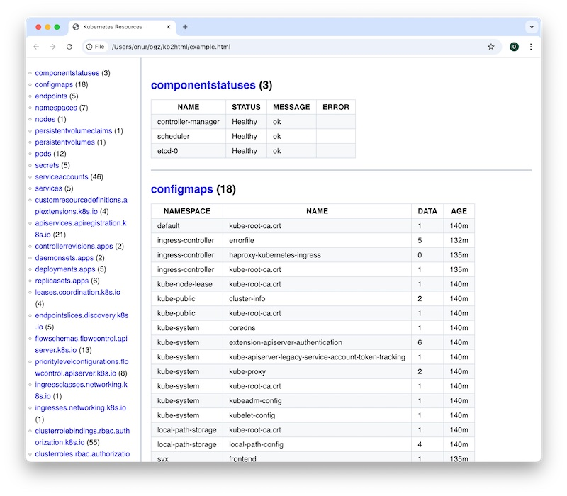

# kb2html

This Bash/AWK script generates an HTML report listing all Kubernetes resources available in your cluster. It uses `kubectl api-resources` to discover resource types and `kubectl get` to retrieve their current state.

### 💡 Usage

```sh
./kb2html.sh > example.html
```

Then open `example.html` in a browser.


